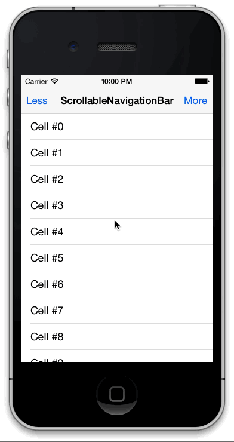

# SherginScrollableNavigationBar

## Usage

To run the example project; clone the repo, and run `pod install` from the Example directory first.

## Demo

## Requirements

## Installation

SherginScrollableNavigationBar is available through [CocoaPods](http://cocoapods.org), to install
it simply add the following line to your Podfile:

    pod "SherginScrollableNavigationBar"

## Author

Valentin Shergin, valentin@shergin.com

## License

SherginScrollableNavigationBar is available under the MIT license. See the LICENSE file for more info.

